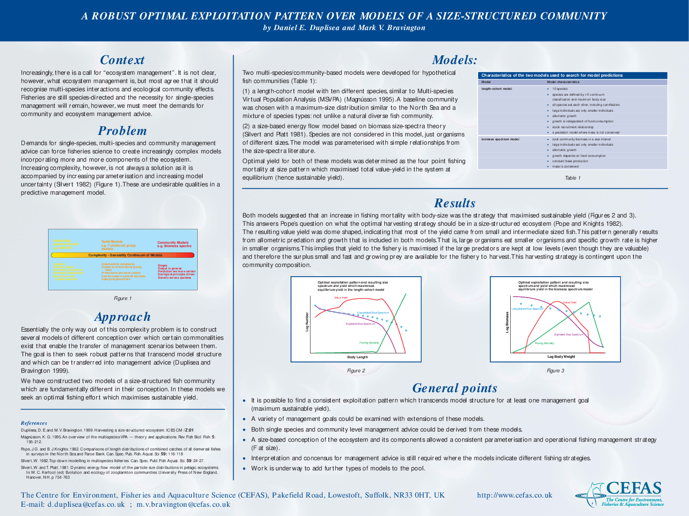

## Background

This is work that was presented at the ICES Annual Science Conference in
Stockholm in September 1999 and at the Canadian Conference for Fisheries
Research in Fredericton January 2000 by Daniel Duplisea and Mark
Bravington (CEFAS, Lowestoft, England).

We constructed two kinds of model: one where the species composition of
a fish community was based on the distribution of Linfinity in an actual
fish community (North Sea) and the predation interactions were
size-based. The initial ideas for this model structure came from
discussion between John Pope, Mark Bravington and Daniel Duplisea. The
second model was based on the Silvert & Platt biomass size spectrum
model. Our goal was to compare what would be the optimal sustainable
size-based fishing strategy for each model.

The first model was coded in excel (Duplisea) while the second model was
coded in Splus (Bravington). Only the first model is available in this
repository. The excel model was the early work leading to the LeMans
size-based modelling approach (Hall et al. 2006).

The ICES CM paper is available here as well as the poster presented at
CCFFR.

## Use

Feel free to use any of this, acknowledgement appreciated.

## References

Duplisea, D.E. and Bravington, M.V., 1999. Harvesting a size-structured
ecosystem. ICES CM, (01), p.16.

Hall, S.J., Collie, J.S., Duplisea, D.E., Jennings, S., Bravington, M.
and Link, J., 2006. A length-based multispecies model for evaluating
community responses to fishing. Canadian Journal of Fisheries and
Aquatic Sciences, 63(6), pp.1344-1359.

Pope, J.G., Rice, J.C., Daan, N., Jennings, S. and Gislason, H., 2006.
Modelling an exploited marine fish community with 15 parameters–results
from a simple size-based model. ICES Journal of Marine Science, 63(6),
pp.1029-1044.
